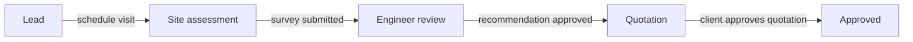

# Solar PMS

A Django project-management system for solar installers. It takes a customer from **first contact to an approved quotation**: client registration, site assessment, engineer-reviewed system sizing, quotation (with PDF export), plus an equipment catalog that feeds the sizing and pricing.

> Sections marked `TODO` depend on files that aren't covered by `views.py` / `urls.py` (settings, models, requirements). Fill them in from the repo.

---

## Table of contents

1. [Workflow at a glance](#workflow-at-a-glance)
2. [Roles and access rules](#roles-and-access-rules)
3. [Route map](#route-map)
4. [How the views are organised](#how-the-views-are-organised)
5. [Business rules worth knowing](#business-rules-worth-knowing)
6. [Getting started](#getting-started)
7. [Development workflow (version control)](#development-workflow-version-control)
8. [Known gaps and follow-ups](#known-gaps-and-follow-ups)

---

## Workflow at a glance

Each client has one or more **projects**. A project moves through these statuses, and each step is driven by a specific view:



| Phase | What happens | View | Status change |
|---|---|---|---|
| 1. Registration | Customer and a paired project are created in **one transaction** | `client_register` | creates project at **Lead** |
| 2a. Schedule visit | Book or reschedule the site visit | `site_assessment_schedule` | Lead → **Site assessment** |
| 2b. Survey | Roof, shading, electrical, devices, access. Submitting completes the assessment and runs the sizing calculator | `site_assessment_survey` | → **Engineer review** |
| 6. Review | Engineer adjusts the matched equipment and signs off | `site_assessment_recommendation` | Engineer review → **Quotation** (on approve) |
| 7. Quotation | Bill of materials pre-filled from the recommendation, then send / approve / reject | `quotation_*` | → **Approved** (on approve) |

Site-assessment screens are reachable from the client detail page, which shows every step of the current project, its state and the links valid for it (see `_project_workflow`).

---

## Roles and access rules

| Role | Sees | Notes |
|---|---|---|
| **Site engineer** (`user.is_site_engineer`) | Only clients where `assigned_rep == user` | Enforced in `client_list`, `client_detail`, `quotations_for_user` and `_get_customer_for_user` |
| **Admin** (`user.is_admin_role`) | Everything | Dashboard also shows catalog totals |

- Self-registration (`register_view`) always creates a **site engineer**.
- If a site engineer registers a client without choosing a rep, the client is assigned to them.
- Every view except login/register requires authentication (`@login_required`).
- All customer-scoped views (Phases 2 to 7) go through `_get_customer_for_user`, which returns `(customer, redirect_or_None)`. Use it for any new customer-scoped view so the ownership rule stays in one place.

---

## Route map

Defined in `urls.py`. **Order matters**: the specific paths `clients/new/` and `catalog/categories/new/` must stay above their `<str:...>` catch-alls.

### Auth and dashboard

| URL | Name | Purpose |
|---|---|---|
| `/` | `login` | Login (honours `?next=`) |
| `/register/` | `register` | Self-registration (site engineer) |
| `/logout/` | `logout` | POST only |
| `/dashboard` | `dashboard` | Role-scoped metrics, embedded for first paint |
| `/dashboard/data/` | `dashboard_data` | JSON feed; the page refreshes from it every 30 s (`never_cache`) |

### Clients and site assessment

| URL | Name | Purpose |
|---|---|---|
| `/clients/` | `client_list` | Browse and search (name, ID, phone, email) |
| `/clients/new/` | `client_register` | Phase 1 registration |
| `/clients/<customer_id>/` | `client_detail` | Profile plus project workflow |
| `/clients/<customer_id>/site-assessment/schedule/` | `site_assessment_schedule` | Book or reschedule the visit |
| `/clients/<customer_id>/site-assessment/survey/` | `site_assessment_survey` | Technical survey and device load list |
| `/clients/<customer_id>/site-assessment/recommendation/` | `site_assessment_recommendation` | Review, save, recalculate, approve |

### Quotations

| URL | Name | Purpose |
|---|---|---|
| `/quotations/` | `quotation_list` | Filterable table with status tabs and totals |
| `/clients/<customer_id>/quotation/` | `quotation_detail` | View |
| `/clients/<customer_id>/quotation/edit/` | `quotation_edit` | Create (gated on sign-off) or edit |
| `/clients/<customer_id>/quotation/print/` | `quotation_print` | Printable page |
| `/clients/<customer_id>/quotation/download/` | `quotation_download` | Server-rendered PDF |
| `/clients/<customer_id>/quotation/send/` | `quotation_send` | POST: mark as sent |
| `/clients/<customer_id>/quotation/approve/` | `quotation_approve` | POST: mark approved, project → Approved |
| `/clients/<customer_id>/quotation/reject/` | `quotation_reject` | POST: mark rejected |

### Equipment catalog

| URL | Name | Purpose |
|---|---|---|
| `/catalog/` | `catalog_home` | Category cards with counts |
| `/catalog/categories/new/` | `category_create` | POST from the "Add category" modal |
| `/catalog/<kind>/` | `equipment_list` | List and search a category |
| `/catalog/<kind>/new/` | `equipment_create` | Add an item |
| `/catalog/<kind>/<pk>/edit/` | `equipment_edit` | Edit an item |
| `/catalog/<kind>/<pk>/delete/` | `equipment_delete` | POST: delete |

---

## How the views are organised

`views.py` is grouped by phase. Supporting modules it depends on:

| Module | Role |
|---|---|
| `models.py` | `Customer`, `Project`, `SiteAssessment`, `SystemRecommendation`, `Quotation`, `QuotationLineItem`, `SolarPanel`, `Inverter`, `Battery`, `Product`, `ProductCategory`, `User` |
| `forms.py` | Registration, schedule, survey and review forms; quotation and site-load formsets |
| `sizing.py` | `calculate_recommendation(assessment)`: rule-based sizing and catalog matching |
| `dashboard_metrics.py` | `build_dashboard_data(user, ...)` for the dashboard |
| `templates/project/` | All templates (`base.html` plus one per screen) |

Key helpers in `views.py`:

- **`_get_customer_for_user`**: shared lookup and access check for Phase 2 to 7.
- **`_project_actions`**: the single "next action" for a project.
- **`_project_workflow`**: every step (visit, survey, recommendation, quotation) with its state (`done | current | todo | locked`) and valid links. Keeps sequencing logic out of the template.
- **`quotations_for_user`**: role-scoped quotations, annotated with the customer's latest project so the list knows which ones are openable.
- **Catalog registry**: `CATALOG_REGISTRY` (panels, inverters, batteries) plus every user-created `ProductCategory`, keyed by URL slug. One set of generic list/form/delete views serves them all, so adding a built-in category means adding a registry entry, not new views.

---

## Business rules worth knowing

**Latest project only.** The Phase 2 to 7 views all act on `customer.projects.order_by("-created_at").first()`. Older projects are read-only in the UI, and `quotation_list` marks quotations on older projects as not openable.

**Sizing runs on every survey save.** `calculate_recommendation` re-runs against whatever has been entered, so the catalog-matched recommendation stays current. The survey page also shows a live readiness panel that mirrors the sizing constants client-side for instant feedback. Keep those constants in sync with `sizing.py`, which is authoritative.

**Quotation gate.** A quotation can only be *created* once the recommendation is engineer-approved (`is_reviewed`). Otherwise `quotation_edit` redirects to the recommendation page.

**Quotation seeding.**
- Equipment lines come from the recommendation (panels, inverter, batteries) at catalog prices.
- Seven standard balance-of-system (BOS) lines are added, each estimated as `rate (KES/kW) x target system size`, rounded to the nearest KES 500. Rates live in `BOS_RATE_KES_PER_KW`. They are a starting estimate for the rep to verify, not a price list.

**PDF export.** `quotation_download` uses `xhtml2pdf` (pure Python, no system libraries). It is imported inside the view, so the app runs without it; if it's missing or rendering fails, the user is redirected to the print page with a message. The PDF uses its own template (`quotation_pdf.html`) because xhtml2pdf doesn't support CSS variables, flexbox or grid. **Update it by hand whenever `quotation_print.html` changes.**

**Atomic transitions.** Registration, scheduling, survey completion and quotation approval each wrap their writes in `transaction.atomic()` so a customer never exists without a project and a status never changes without its record.

---

## Getting started

`TODO`: confirm against the repository.

```bash
git clone <repo-url> solar-pms
cd solar-pms

python -m venv .venv
source .venv/bin/activate          # Windows: .venv\Scripts\activate
pip install -r requirements.txt    # TODO: ensure xhtml2pdf is listed

cp .env.example .env               # TODO: document required variables
python manage.py migrate
python manage.py createsuperuser
python manage.py runserver
```

Open <http://127.0.0.1:8000/> and sign in. New accounts created through **Register** are site engineers; promote admins via the Django admin (`TODO`: document how the admin role is assigned).

Optional dependency: `pip install xhtml2pdf` enables the PDF download.

### Tests

`TODO`: no tests are covered here. The highest-value ones to add first:

- Site-engineer scoping on every customer-scoped view (`_get_customer_for_user`).
- `client_register` creates customer and project atomically, with the right default rep.
- Status transitions along the happy path (Lead to Approved).
- `quotation_edit` blocks creation until the recommendation is reviewed.
- `_estimate_bos_price` rounding and zero-size fallback.

```bash
python manage.py test
```

---

## Development workflow (version control)

### Branching

Trunk-based with short-lived branches off `main`:

```
main            always deployable, protected, changes land via pull request
└─ feat/...     new behaviour
└─ fix/...      bug fixes
└─ refactor/... no behaviour change
└─ docs/...     documentation only
```

Keep branches small and merge often. Prefer squash-merge so `main` reads as one commit per change.

### Commits

Use [Conventional Commits](https://www.conventionalcommits.org/): `type(scope): summary` in the imperative, under ~72 characters, with the *why* in the body when it isn't obvious.

```
feat(clients): two-column registration form with sticky action bar
feat(clients): show full site-assessment workflow on client detail
fix(survey): restore step tracker so the readiness panel renders
fix(survey): stop rescheduling from resetting a completed assessment
docs: add README
```

One logical change per commit, and never mix formatting-only edits with behaviour changes.

### Pull request checklist

- [ ] Scoped to one concern, with a description of what and why
- [ ] New customer-scoped views use `_get_customer_for_user`
- [ ] Multi-model writes are inside `transaction.atomic()`
- [ ] State-changing endpoints are `@require_POST`
- [ ] Model changes include a **committed migration**, and `makemigrations --check` is clean
- [ ] If the quotation layout changed, both `quotation_print.html` **and** `quotation_pdf.html` were updated
- [ ] If sizing constants changed, `sizing.py` **and** the survey page's JS mirror were updated
- [ ] Tested as both an admin and a site engineer

### Repository hygiene

- Commit migrations. Never commit `.env`, secrets, `db.sqlite3`, `__pycache__/`, `.venv/` or uploaded media.
- Pin dependencies in `requirements.txt` so builds are reproducible.
- Tag releases with [SemVer](https://semver.org/) (`v1.4.0`) and keep a `CHANGELOG.md`.
- Never rewrite history on `main`; use `git revert` to undo a merged change.

---

## Known gaps and follow-ups

Noted while documenting `views.py`. They're current behaviour, not necessarily intended, and each would make a good small `fix/` branch.

1. **Survey re-save can regress the project.** `site_assessment_survey` sets the project back to *Engineer review* on every valid save, even if it's already at *Quotation* or *Approved*. Guard it so the status only moves back if the project is still earlier in the pipeline.
2. **Rescheduling a completed assessment** resets its status to *Scheduled*. The UI hides the link once the survey is done, but the view itself doesn't block it.
3. **Quotation transitions are unguarded.** `quotation_send`, `quotation_approve` and `quotation_reject` don't check the current status, so a draft can be approved directly, or an approved quotation rejected.
4. **Catalog and admin capabilities aren't role-gated.** Any logged-in user, including a site engineer, can create categories and edit or delete catalog items.
5. **`equipment_delete` hard-deletes.** Items already referenced by a recommendation or quotation line may cause integrity errors or lost history. Consider soft-delete via `is_active`, which the catalog counts already respect.
6. **Recommendation review writes without a completeness check.** Approving moves the project forward only if it is currently *Engineer review*, which is right, but no check prevents approving an out-of-date recommendation after the survey changed.
7. **Quotation total is the line-item subtotal** (`subtotal_kes`); tax and discounts aren't modelled.
